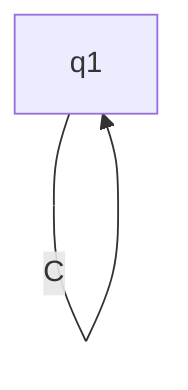

# Deterministic-Finite-Automaton


Das Zahnrad repräsentiert die natur eines deterministischen endlichen automaten.

> Logo erstellt mithilfe von [craiyon](https://www.craiyon.com/)

Es folget eine kurze erläuterung des Programms

- [Deterministic-Finite-Automaton](#deterministic-finite-automaton)
  - [Automaton](#automaton)
  - [Transition Table](#transition-table)
  - [Beispiele](#beispiele)

## Automaton

Die Klasse befindet sich in [automaton.py](src/automaton.py).

In ihr befindet sich ein [transition Table](#transition-table), ein Alphabet, die existierenden states, der start state und alle aktzeptierten states. Erstellen kann man einen Automaten wie folgt:  

```python
automaton = Automaton(
    alphabet="AB",
    number_of_states=3,
    initial_state=0,
    accepted_states={0, 1},
    transition_table={
        0: {"B": 1},
        1: {"A": 2},
        2: {"A": 2, "B": 2}
    }
)
``` 

## Transition Table

Die Transition Tables *([wikipedia](https://en.wikipedia.org/wiki/State-transition_table))* skalieren sich relativ zu den States quadratisch, sind daher sehr mühsam manuell anzugeben.  

Ein guter standartwert ist für diese aber, dass sich die Nodes selber referieren.



Dies realisiere ich, in dem ich eine Subklasse des Python Dictionarys erstelle, und in der Methode die die Werte zurückgebe eine Funktion einfüge, die diese Werte automatisch zurückgeben. Somit konnte ich eine *sozusagen unendlichen* Transition Table implementieren.

Dies kann in [automaton.py](src/automaton.py) gefunden werden.

## Beispiele

In [examples.py](src/examples.py) können Beispiele gefunden werden.

So ist dort auch das Beispiel, aus dem Abschnitt [Automaton](#automaton). Dies erstellt einen automaten, der nur Wörter, bei denene `A`s vor den `B`s kommen akzeptiert. *[[a_before_b()](src/examples.py)]*

Auch habe ich eine funktion implementiert, die dynamisch Automaten erstellt, die nur Wörter akzeptieren in denen mindestens ein belibiges Wort vorkommt. *[[contains_the_word()](src/examples.py) oder [get_automaton_contains_the_word(word: str)](src/examples.py)]*
